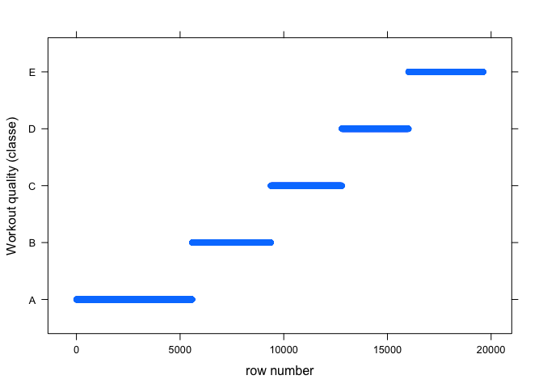

# Workout quality recognition by machine learning on fitness sensor data
Wei Wei  
June 25, 2016  


## Synopsis

Using personal fitness trackers collecting large amounts of sensor data, it has been possible to quantify how much a person carries out a particular activity. But rarely has it been addressed how _well_ the person carries out that particular activity. The goal of this project is to use the Weight Lifting Exercise Dataset, kindly provided by groupware@les, to correctly predict how _well_ a person lifts weights.

The dataset was collected from accelerometers on the belt, forearm, arm, and dumbbell of 6 participants. They were asked to perform barbell lifts correctly and incorrectly in 5 different ways, classified as "A" to "E":

- A: exactly according to the specification
- B: throwing the elbows to the front
- C: lifting the dumbbell only halfway
- D: lowering the dumbbell only halfway
- E: throwing the hips to the front

Read more [here][1]. Using this dataset, a machine learning model was trained and selected based on accuracy performance. The model was then used to predict the workout quality classifications on 20 different test cases. 

[1]: http://groupware.les.inf.puc-rio.br/har#ixzz4CNLAdGub "here"

## HAR data processing and exploratory analysis

#### Basic data structure

The HAR Weight Lifting Exercises Datasets were downloaded and read into Rstudio as "data" and "dataToFit" data frame objects using the read.csv function. "data" contains 19622 observations on 160 variables; while "dataToFit" contains only 20 observations. 

The 1st variable, "X", contains sequentially incrementing integers that are the indexes of each observations. Names of users, timestamp, and sliding-window information are found in the 2nd to the 7th variables. Data collected from the wearable accelerometers are in the 8th to the 159th variables. The 160th variable, "classe", contains the workout classification data with the values of "A" to "E".

"dataToFit" has all the same variables as "data", except that the 160th variable is "problem_id" instead of "classe". The goal of this report is to train a suitable machine learning model and use the selected model to predict the workout quality for the 20 observations in the "dataToFit" dataset.

See R code chunk and output below for data download and summary information.


```r
# download data
rm(list=ls())
urlTrain <- "https://d396qusza40orc.cloudfront.net/predmachlearn/pml-training.csv"
urldataToFit <- "https://d396qusza40orc.cloudfront.net/predmachlearn/pml-testing.csv"
if(!dir.exists("../webData")) {dir.create("../webData")}
if(!file.exists("../webData/HARtrain.csv")) 
      {download.file(urlTrain, destfile="../webData/HARtrain.csv", method="curl" )}
if(!file.exists("../webData/HARdataToFit.csv")) 
      {download.file(urldataToFit, destfile="../webData/HARdataToFit.csv", method="curl")}
data <- read.csv("../webData/HARtrain.csv")
dataToFit <- read.csv("../webData/HARdataToFit.csv")


# basic information on the 2 datasets
dim(data); dim(dataToFit)
```

```
## [1] 19622   160
```

```
## [1]  20 160
```

```r
head(names(data), 9L); tail(names(data), 3L); tail(names(dataToFit), 3L)
```

```
## [1] "X"                    "user_name"            "raw_timestamp_part_1"
## [4] "raw_timestamp_part_2" "cvtd_timestamp"       "new_window"          
## [7] "num_window"           "roll_belt"            "pitch_belt"
```

```
## [1] "magnet_forearm_y" "magnet_forearm_z" "classe"
```

```
## [1] "magnet_forearm_y" "magnet_forearm_z" "problem_id"
```


#### Data reduction and variable selection

Firstly, it is found that in "data" 67 out of 160 variables have missing data (NAs), and each of these 100 variables contains 19216 NAs out of total 19622 observations; while in "dataToFit" 100 out 160 variables have NAs, and each of these 100 variables contains only NAs. Variables that contain NAs in either "data" or "dataToFit" were excluded from downstream analysis. 

Secondly, the 2nd to the 7th variables were removed since the sensor data should be user-agnostic, and timestamp, number of sliding-windows information should not be relevant to workout quality prediction.

Thirdly, the presence of near zero variance variables were checked and none were found. Therefore, all the remaining variables were kept.

Lastly, the "classe" values in "data" were found to be grouped (see figure below). To ensure randomness in the "classe" values in the dataset, the row order of "data" was scrambled with the seed set at "1234".

See R code chunk and output below for data reduction and variable selection.


```r
# count number of variables that contain missing data
table(colSums(is.na(data))); table(colSums(is.na(dataToFit)))
```

```
## 
##     0 19216 
##    93    67
```

```
## 
##   0  20 
##  60 100
```

```r
# select only variables that do not contain missing data in either datasets
data <- subset(data, select=colSums(is.na(data)) == 0 & colSums(is.na(dataToFit)) == 0)
dataToFit <- subset(dataToFit, select=names(dataToFit) %in% c(names(data), "problem_id"))

# exclude time-stamp and sliding-window related variables
data <- data[, -c(2:7)]
dataToFit <- dataToFit[, -c(2:7)]

# flag near zero variance variables
suppressMessages(library(caret, quietly=TRUE, warn.conflicts=FALSE))
length(nearZeroVar(data, saveMetrics = FALSE, names = TRUE))
```

```
## [1] 0
```

```r
dim(data); dim(dataToFit)
```

```
## [1] 19622    54
```

```
## [1] 20 54
```

```r
# exploratory data analysis
table(data$classe)
```

```
## 
##    A    B    C    D    E 
## 5580 3797 3422 3216 3607
```

```r
library(lattice)
xyplot(classe ~ 1:dim(data)[1], data, xlab="row number", ylab="Workout quality (classe)")
```

<!-- -->

```r
# scramble row order in data
set.seed(1234)
data <- data[sample(nrow(data)), ]
```


## Machine learning model training and selection

Since random forests and boosting are among the most common and better performing machine learning algorithms in use, random forests (rf) and generalized boosting model (gbm) were selected for model training using the caret package. Accuracy was set as the metrics for model performance evaluations, since it is an appropriate metrics for factor variables, like "classe". 

The "data" dataset was split in 70/30 ratio into a "training" and a "testing" dataset. The "training" dataset was used to train both a random forest model and a generalized boosting model, both using 10-fold cross-validation.

The random forest model (rfMod) outperformed the generalized booting model (gbmMod) on in-sample accuracy, 0.9923560 vs 0.9622918, and was thus selected. 

See R code chunk and output below for model training and selection.


```r
# split tidy data into training and testing datasets in 70/30 portions
# using random data sampling createDataPartition function from the caret package
suppressMessages(library(caret, quietly=TRUE, warn.conflicts=FALSE))
suppressMessages(library(randomForest, quietly=TRUE, warn.conflicts=FALSE))
suppressMessages(library(gbm, quietly=TRUE, warn.conflicts=FALSE))


set.seed(1234)
inTrain <- createDataPartition(y=data$classe, p=0.7, list=FALSE)
training <- data[inTrain, ]
testing <- data[-inTrain, ]


# model training on training dataset
library(parallel, quietly=TRUE, warn.conflicts=FALSE)
library(doParallel, quietly=TRUE, warn.conflicts=FALSE)
library(plyr, quietly=TRUE, warn.conflicts=FALSE)

cluster <- makeCluster(detectCores() - 1) # 1 core for the OS
registerDoParallel(cluster)
trControl <- trainControl(method = "cv", number = 10, allowParallel = TRUE)

# 1st model: random forest
rfMod <- train(classe ~., method="rf", data=training[, -1], trControl=trControl, metric="Accuracy")
rfMod$results ## Accuracy : 0.9923560
```

```
##   mtry  Accuracy     Kappa  AccuracySD     KappaSD
## 1    2 0.9909002 0.9884874 0.003351258 0.004240991
## 2   27 0.9923560 0.9903302 0.002978986 0.003769039
## 3   52 0.9867502 0.9832373 0.004618143 0.005842575
```

```r
# 2nd model: generailized boosting regression
gbmMod <- train(classe ~., method="gbm", data=training[, -1], trControl=trControl, metric="Accuracy", verbose=F)
gbmMod$results[, 4:8] ## Accuracy : 0.9622918
```

```
##   n.trees  Accuracy     Kappa  AccuracySD     KappaSD
## 1      50 0.7541672 0.6883862 0.008239492 0.010606935
## 4      50 0.8573169 0.8191788 0.009024274 0.011474167
## 7      50 0.8976475 0.8704423 0.004547668 0.005781756
## 2     100 0.8233223 0.7762904 0.007248170 0.009169962
## 5     100 0.9092951 0.8852441 0.006091076 0.007702138
## 8     100 0.9412526 0.9256647 0.006813406 0.008636994
## 3     150 0.8537522 0.8149464 0.004545680 0.005709903
## 6     150 0.9320803 0.9140609 0.006055360 0.007659569
## 9     150 0.9622918 0.9522922 0.004239867 0.005372608
```


## Model performance (out-of-sample accuracy) evaluation on "testing" dataset

The selected random forests model (rfMod) was applied to the hold-out samples of the "testing" dataset. The out-of-sample accuracy was found to be 0.9937. 

With a high in-sample accuracy of 0.9923560, it was a concern that the random forests model may have overfitted the "training"" dataset. When models overfit, it is expected to observe the out-of-sample error rate larger than the in-sample error rate. Since the out-of-sample accuracy of 0.9937 is actually better than the in-sample accuracy of 0.9923560, the random forests model did not overfit the "training" dataset.

The top-10 most important variables were identified in the random forests model. It was found that 3 were from the belt sensor, 3 from the forearm sensor, 4 from the dumbbell sensor, and none from the sensor on the arm.

See R code chunk and output below for out-of-sample model performance evaluation.


```r
# select and fit the best model on testing dataset to evaluate out-of-sample accuracy
predTest <- predict(rfMod, newdata=testing)
confusionMatrix(predTest, testing$classe) # Accuracy : 0.9937
```

```
## Confusion Matrix and Statistics
## 
##           Reference
## Prediction    A    B    C    D    E
##          A 1673    4    0    0    0
##          B    1 1131    4    0    1
##          C    0    4 1020   14    3
##          D    0    0    2  949    3
##          E    0    0    0    1 1075
## 
## Overall Statistics
##                                           
##                Accuracy : 0.9937          
##                  95% CI : (0.9913, 0.9956)
##     No Information Rate : 0.2845          
##     P-Value [Acc > NIR] : < 2.2e-16       
##                                           
##                   Kappa : 0.992           
##  Mcnemar's Test P-Value : NA              
## 
## Statistics by Class:
## 
##                      Class: A Class: B Class: C Class: D Class: E
## Sensitivity            0.9994   0.9930   0.9942   0.9844   0.9935
## Specificity            0.9991   0.9987   0.9957   0.9990   0.9998
## Pos Pred Value         0.9976   0.9947   0.9798   0.9948   0.9991
## Neg Pred Value         0.9998   0.9983   0.9988   0.9970   0.9985
## Prevalence             0.2845   0.1935   0.1743   0.1638   0.1839
## Detection Rate         0.2843   0.1922   0.1733   0.1613   0.1827
## Detection Prevalence   0.2850   0.1932   0.1769   0.1621   0.1828
## Balanced Accuracy      0.9992   0.9959   0.9949   0.9917   0.9967
```

```r
# identify the top-10 most important variables in the random forest model
imp <- varImp(rfMod)$importance
newImp <- data.frame(variable=rownames(imp), importance=imp$Overall)
newImp <- newImp[order(newImp$importance, decreasing=TRUE), ]
rownames(newImp) <- 1:dim(newImp)[1]
head(newImp, 10L)
```

```
##             variable importance
## 1          roll_belt  100.00000
## 2      pitch_forearm   58.96172
## 3           yaw_belt   56.28592
## 4  magnet_dumbbell_z   45.50130
## 5  magnet_dumbbell_y   44.53004
## 6       roll_forearm   44.01026
## 7         pitch_belt   42.88272
## 8   accel_dumbbell_y   20.47305
## 9    accel_forearm_x   17.80648
## 10     roll_dumbbell   16.58776
```


## Prediction of workout quality using the selected machine learning model

The random forests model (rfMod) was used to predict the workout quality classifications of the 20 cases in "dataToFit". With the out-of-sample accuracy of 0.9937, the probability of correctly predicting all 20 cases is 0.88.


```r
# fit model on dataToFit dataset to predict/recognize workout quality
rfDataToFit <- predict(rfMod, newdata=dataToFit)

# probability of predicting all 20 workout quality correctly 
# using the rfMod with the out-of-sample accuracy of 0.9937
round(0.9937^20, 2)
```

```
## [1] 0.88
```

```r
stopCluster(cluster)
```


